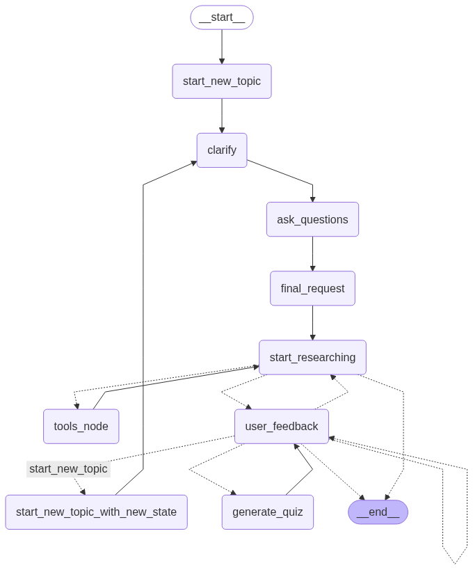

# Health Bot

[](https://github.com/langchain-ai/new-langgraph-project/actions/workflows/unit-tests.yml)
[](https://github.com/langchain-ai/new-langgraph-project/actions/workflows/integration-tests.yml)

This template demonstrates a simple application implemented using [LangGraph](https://github.com/langchain-ai/langgraph), designed for showing how to get started with [LangGraph Server](https://langchain-ai.github.io/langgraph/concepts/langgraph_server/#langgraph-server) and using [LangGraph Studio](https://langchain-ai.github.io/langgraph/concepts/langgraph_studio/), a visual debugging IDE.

## Overview

Health Bot is an intelligent conversational agent built using LangGraph that provides reliable health information to users. The bot can answer questions about various health topics, medical conditions, and treatments in patient-friendly language. It uses a structured conversation flow to gather necessary context before providing comprehensive answers.

<div align="center">
  
</div>

## Features

- **Interactive Health Information**: Ask questions about any health topic and receive concise, accurate information.
- **Clarification Questions**: The bot asks follow-up questions to better understand your specific needs.
- **Web Search Integration**: Uses Tavily Search API to retrieve up-to-date medical information from reliable sources.
- **Patient-Friendly Language**: All responses are presented in clear, accessible language.
- **Customizable Workflow**: The conversation flow can be extended or modified to suit different healthcare information needs.

## Getting Started
### Prerequisites
- Python 3.9+
- OpenAI API key
- Tavily API key

### Installation
1. Clone this repository:
```bash
git clone https://github.com/tanluuuuuuu/health-bot.git
cd health-bot
```
2. Install dependencies, along with the LangGraph CLI:
```bash
pip install -e . "langgraph-cli[inmem]"
```
3. Create a .env file with your API keys:
```bash
cp .env.example .env 
```
Edit the .env file to include:
```dotenv
OPENAI_API_KEY=your_openai_api_key
TAVILY_API_KEY=your_tavily_api_key
```

### Running the Bot
#### Using the Command Line
```bash
python -m src.main
```
This will start an interactive session where you can ask health-related questions.

## How It Works
The Health Bot uses a multi-step workflow:
1. **User Query**: The user asks a health-related question.
2. **Clarification**: The bot may ask follow-up questions to better understand the user's needs.
3. **Information Retrieval**: The bot searches for relevant information using the Tavily Search API.
4. **Response Generation**: The bot synthesizes the information into a clear, concise answer.

The core logic is defined in `src/agent/graph.py`, which orchestrates the conversation flow between different components.

## How to customize

### Modifying the Bot's Behavior
1. **Define configurable parameters**: Modify the `Configuration` class in `graph.py` to expose arguments you want to configure, such as the model to use or response length.
2. **Extend the graph**: Add new nodes or edges to change the conversation flow or add new capabilities.
3. **Customize prompts**: Edit the prompt templates in the `src/prompts` directory to change how the bot interacts with users.

### Adding New Health Topics
The bot automatically searches for information on any health topic. However, you can enhance its knowledge by:
1. Adding specialized prompt templates for common conditions
2. Implementing domain-specific tools for particular health areas
3. Fine-tuning the underlying model with medical knowledge

## Development

While developing, you can use LangGraph Studio to visualize and debug the conversation flow. Local changes will be automatically applied via hot reload.

For more advanced features and examples, refer to the LangGraph documentation.

LangGraph Studio integrates with LangSmith for in-depth tracing and collaboration, allowing you to analyze and optimize your bot's performance.

## License

This project is licensed under the MIT License - see the LICENSE file for details.

## Acknowledgments
- Built with LangGraph and LangChain
- Uses Tavily for web search capabilities
- Powered by OpenAI's language